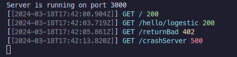

# Logestic

[](https://badge.fury.io/js/logestic)

An advanced and customisable logging library for [ElysiaJS](https://elysiajs.com).

## Table of Contents

- [Logestic](#logestic)
- [Table of Contents](#table-of-contents)
- [Installation](#installation)
- [Configuration](#configuration)
- [Usage](#usage)
  - [Preset logging](#preset-request-logging)
  - [Custom logging](#custom-request-logging)
- [Contributing Guidelines](#contributing-guidelines)
- [License](#license)

## Installation

Add the package to your Elysia Project via [bun](https://bun.sh). 
```bash
  bun add logestic
```
**Note**: You must have `elysia@1.0` installed in your project.

## Usage

There are two ways to add logging to your Elysia application.

### Preset request logging

Currently, there are these [presets](./src/presets/index.ts) available to use. 

```typescript
import { Elysia } from 'elysia';
import { Logestic } from 'logestic';

const app = new Elysia()
  .use(Logestic.preset('common'))
  .get('/', () => "Hello from server")
  /* ... */
  .listen(3000, () => {
    console.log("Server is running on port 3000")
  });
```



### Custom request logging

If you don't like any of presets, you can configure Logestic to log your requests in your way.

1. Create a `Logestic` instance, optionally where you wish to log.
2. Call `use` to tell `Logestic` the information you wish to use.
3. Finally, create an `Elysia` instance on `custom` with the formatting function. 

```typescript
// ./logger.ts
import { Logestic, chalk } from 'logestic';

// exports an Elysia instance
export default new Logestic()
  .use(['method', 'path', 'time', 'status'])
  .format({
    onSuccess({ method, path, time, status }) {
      return `[${time}]: ${method} ${path} | ${status}`
    },
    onFailure({ request, error, code, datetime }) {
      return chalk.red(`ERROR [${datetime}]: ${request.method} ${request.url} | ${code}`)
    }
  });

// ./index.ts
import myLogger from './logger';

const app = new Elysia()
  .use(myLogger)
  .get('/', () => "Hello from server")
  /* ... */
  .listen(3000, () => {
    console.log("Server is running on port 3000")
  });
```

Consider contributing your own preset; check [contributing guidelines](#contributing-guidelines).

## Configuration

| Name | Type | Description | Default |
| :--: | :--: | :-------- | :----- |
| dest | `BunFile` | The destination file for logging. | `Bun.stdout` |
| showLevel | `boolean` | Whether to show the log level. | `false` |
| logLevelColour | `LogLevelColour` | The colour of each log level. | `{ [key in LogType]: undefined }` |
| httpLogging | `boolean` | Log successful http requests | `true` |
| explicitLogging | `boolean` | Allow logging for explicit calls | `true` |

## Contributing Guidelines

See [CONTRIBUTING.md](./CONTRIBUTING.md)

## License

[MIT](./LICENSE)
