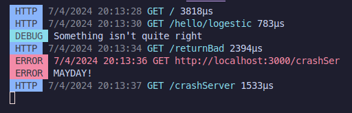

# Logestic

[](https://badge.fury.io/js/logestic)

[Demo](./preview/src/index.ts) &bullet; [Documentation](https://github.com/cybercoder-naj/logestic/wiki) &bullet; [Changelog](./CHANGELOG.md) &bullet; [License](./LICENSE)

An advanced and customisable logging library for [ElysiaJS](https://elysiajs.com).

<div align="center">

</div

## Table of Contents

- [Logestic](#logestic)
- [Table of Contents](#table-of-contents)
- [Installation](#installation)
- [Usage](#usage)
- [Contributing Guidelines](#contributing-guidelines)

## Installation

Add the package to your Elysia Project via [bun](https://bun.sh). 
```bash
  bun add logestic
```

## Compatibility Matrix

| Logestic Version | Elysia Version | Compatible? |
| :--------------: | :------------: | :---------: |
| <= v1.2.0           | v1.0.9         | ✅ |
| v1.2.0 - v1.2.1           | v1.1.0         | ❌ |
| >= v1.2.2           | v1.1.3         | ✅ |

## Usage

There are two ways to add logging to your Elysia application. The quickest way to use this logger is using a preset. 

```typescript
import { Elysia } from 'elysia';
import { Logestic } from 'logestic';

const app = new Elysia()
  .use(Logestic.preset('common'))
  .get('/', () => "Hello from server")
  /* ... */
  .listen(3000, () => {
    console.log("Server is running on port 3000")
  });
```

These [presets](https://github.com/cybercoder-naj/logestic/wiki/Presets) available to use. 

## Contributing Guidelines

See [CONTRIBUTING.md](./CONTRIBUTING.md)